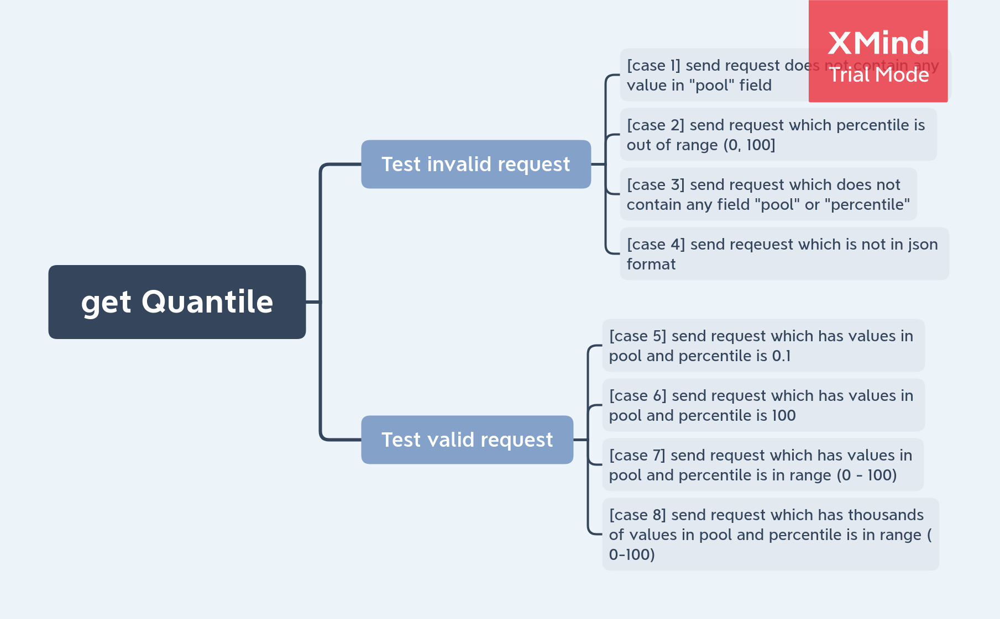

# API-GATEWAY
A simple service for calculate statistics

## Table of contents
1. [Build](##build)
2. [Run](##run)
3. [Testing](##testing)
4. [Documentation](##documentation)
    * [Endpoint](###endpoint)
    * [Reponse format](###reponse-format)
    * [Project structure](###project-structure)
5. [Contributor](##contributor)
6. [Issues](##issues)

## Build
Prerequisite:  
- Go 1.15 or above
- Linux

build single binary:

        make build       
        
build docker:
    
        docker build -t api-gateway:1.0.0 .
        docker save api-gateway:1.0.0 > gateway.tar

## Run
run single binary

        ./api-gateway
        
run docker:

        docker stop api-gateway
        docker load -i gateway.tar
        docker-compose up -d --force-recreate api_gateway

## Testing

        make test

## Documentation  
### Endpoint:
  
        [POST] http://localhost:9090/api/v1/statistics/quantile
        
The algorithm for calculating quantile is followed by: 
1. [Quantile: Definition and How to Find Them in Easy Steps](https://www.statisticshowto.com/quantile-definition-find-easy-steps/+)
2. [Find percentile and quantile values](https://docs.influxdata.com/influxdb/cloud/query-data/flux/percentile-quantile/)
3. [Quantile - Wikipedia](https://en.wikipedia.org/wiki/Quantile)
        
### Reponse format:  

        {
            "message": 2,
            "code": 200,
            "description": "The point which 2% of values in the pool are less than or equal is 2"
        } 
Where
- message: contain quantile value
- code: status code
- description: a brief explanation for quantile value  

### Test design:  

  
### Project structure:
- controllers: contains all logic code for request   
- docs: document files for swagger  
- models: contains models for parsing json object from request  
- utils: contain utilities and helper functions
- vendor: a directory contains all package need for compiling
- .env: file config 

## Contributor
[Tat-Huy Tran](https://www.linkedin.com/in/trantathuy/)

## Issues
1. Due to logic of go validator framework, when it check existences of a number-type field, this field cannot receive
value of zero. Thus, when doing send request, the value of percentile must larger than 0.  